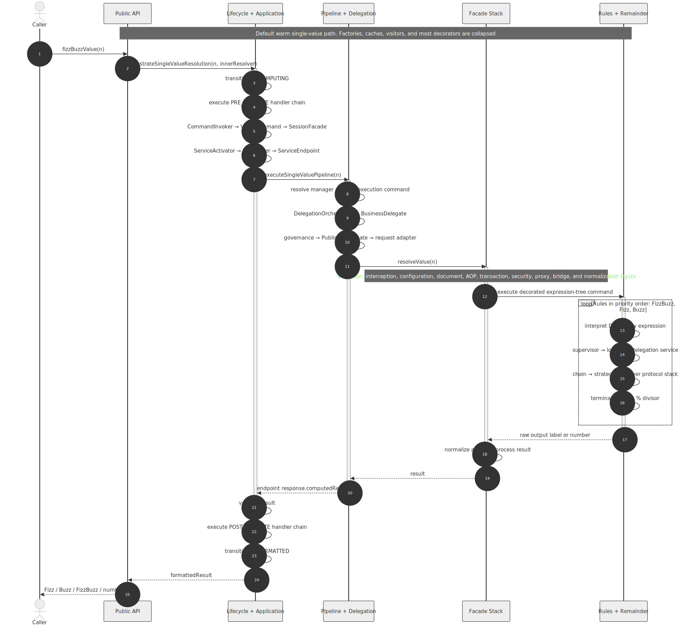

# Architecture diagrams

These diagrams describe the default single-value path behind
`fizzBuzzValue(n)`. They deliberately collapse singleton factories, caches,
visitors, and large decorator stacks; drawing every generated type would make
the diagrams accurate only in the cartographic sense.

## Function flow

The sequence follows a warm call from the public API to a terminal native
modulo implementation and back. Cold-start bootstrap and factory construction
are omitted.

[Mermaid source](diagrams/function-flow.mmd)

## System UML

The class diagram presents the representative contracts and roles that form
the default computation path. Each box stands for a subsystem family rather
than every interface, abstract base, implementation, factory, and decorator in
that family.

[Mermaid source](diagrams/system-uml.mmd)

### Representative implementations

| Diagram role | Representative project type |
| --- | --- |
| Lifecycle orchestrator | `DefaultEnterpriseComputationResolutionLifecycleOrchestratorImpl` |
| Value command | `FizzBuzzValueComputationCommandImpl` |
| Session facade | `DefaultEnterpriseFizzBuzzPublicApiSessionFacadeImpl` |
| Service endpoint | `FizzBuzzEnterpriseServiceEndpointImpl` |
| Pipeline manager | `DefaultFizzBuzzPipelineManagerImpl` |
| Pipeline execution command | `DelegationOrchestratorPipelineExecutionCommandImpl` |
| Delegation orchestrator | `DelegatingEnterpriseFizzBuzzResolutionDelegationOrchestratorImpl` |
| Business delegate | `ServiceLocatorManagedFizzBuzzEnterpriseBusinessDelegateImpl` |
| Public API resolution delegate | `InfrastructureManagedEnterpriseFizzBuzzPublicApiResolutionDelegateImpl` |
| Resolution facade | `FizzBuzzSingleValueResolutionFacadeImpl` and its decorator stacks |
| Expression command | `ExpressionTreeBasedFizzBuzzValueResolutionCommandImpl` |
| Divisibility expression | `DivisibleByExpressionImpl` |
| Remainder supervisor | `StandardRemainderComputationSupervisorImpl` |
| Terminal arithmetic | `PhysicalLayerComputationProtocolImpl` and other native modulo strategies |
